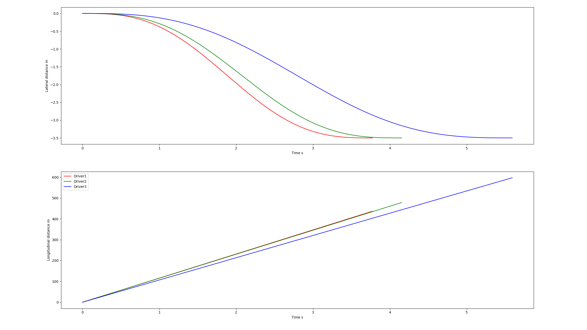

# Personalizing-ADAS-in-CARLA

This project aims to personalize Advanced Driving-assistance Systems ([ADAS](https://en.wikipedia.org/wiki/Advanced_driver-assistance_systems)) for autonomous vehicles with the self-driving cars simulator [CARLA](http://carla.org/). The two main focus are on personalizing ***lane changing*** and personalizing Adaptive Cruise Control ([ACC](https://en.wikipedia.org/wiki/Adaptive_cruise_control)) that includes ***vehicle following*** a*nd **lane following***. 

## Demonstration

<p align = "center">
    
    <br>
    <em>Lane Following Case</em>
    <br>
    
    <br>
    <em>Vehicle Following Case</em>
    <br>
    
    <br>
    <em>Lane Changing Case </em> 
    <br>
</p>

## Test Platform

Ubuntu 18.04
[CARLA](http://carla.org/) 0.9.8

#### Carla Simulator Installation
Go to official [Carla Releases](https://github.com/carla-simulator/carla/releases) Github page.

Download **[Linux] CARLA 0.9.8**, unzip the file and rename the folder as **CARLA_Simulator**. Additional maps are optional.

Put **CARLA_Simulator** folder and **this repository** folder in the same folder. So the folder structure should look like:

```
Carla                              
├── Assistive-Driving-in-CARLA     # This repository
│   ├── agents                     # Self-driving and Personalization module
│   │   ├── ...
│   ├── data                       # Useful data
│   │   ├── ...
│   ├── demo                       # Demonstration for README
│   │   ├── ...
│   ├── environment                # Scenes and different scenes set up
│   │   ├── ...
│   ├── LICENSE                    
│   ├── README.md
└── CARLA_Simulator                # Carla Simulator of suggested version    
    ├── ...                    
```

#### Other prerequisites

`numpy`,  `scikit-learn`,  `casadi`,  `opencv` and `pygame` should be correctly installed.

`jstest-gtk` is also needed if one would run Carla with a hardware steering wheel, a Logitech steering wheel for example.

## Run Instruction

#### Performing Phase

1. Go to **CARLA_Simulator** folder,

   `cd Carla/CARLA_Simulator` 

   run CARLA in Low Graphic Quality

   `./CarlaUE4.sh -quality-level=Low`

   or off-screen mode.

   `DISPLAY= ./CarlaUE4.sh -opengl`

2. Go to the **environment folder** of **this repository**. 

   `cd Carla/Assistive-Driving-in-CARLA/environment `

   There are options for generating different scenes. 

   To perform personalized ACC when there is no vehicle in front, also known as ***lane following***, generate scene 0 where only the ego vehicle exists by:

   `python ego_vehicle.py`

   To perform personalized ACC for ***vehicle following***, generate the first scene where one vehicle is in front of the ego vehicle by:

   `python ego_vehicle.py -s 1`

   To perform personalized ***lane changing***, generate the second scene where multiple vehicles are surrounding the ego vehicle:

   `python ego_vehicle.py -s 2` 
   
3. If one would like to run it with hardware setup, he could run it by:

   `python ego_vehicle.py -hw 1`

   which will use both keyboard, steering wheel and pedal control as vehicle inputs.

   

#### Learning Phase

The vehicle is initialized with autopilot mode on. To switch between manual control and autopilot mode, press `p`. 

To start or end the learning process, press `l` in manual control mode. Noted that starting and ending learning process would only collect driver's behavior data. One has to press `t` to let the model learn from the data and be stored locally.

After learning, one could regenerate the scene by pressing `Backspace` and turn autopilot mode on to see the performance of the vehicle.

It is advisable to personalize ***lane following*** in front in scene 0, to clone ***vehicle following*** behavior in scene 1, and to teach the model ***lane changing*** in scene 2.

## Personalization

Some sets of data of 3 different drivers are stored in **data/Driver_Data**.

#### Lane Following

personalized parameter: **target_speed**

method: **GMM**

<p align = "center">
    
    <br>
    <em>Driver 1 Set 1 Target Speed Histogram Plot & V-t Plot</em>
    <br>
    
    <br>
    <em>All sets of 3 drivers' data</em>
</p>

#### Vehicle Following

personalized parameter: **Time Headway (THW)**

method: **GMM**

<p align = "center">
    
    <br>
    <em>Driver 1 Set 1 THW, TTCi</em>
    
    <br>
    <em>All sets of 3 drivers' data</em>
</p>

#### Lane Changing

personalized parameter: **Lateral Time, Longitudinal Velocity**

method: **GMM + COS Trajectory**

<p align = "center">
    
    <br>
    <em>3 drivers' trained models perform in standard case [10m/s, -3.5m, 15m, -12m]</em>
</p>

